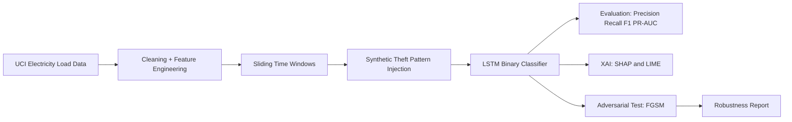

# Electricity Theft Detection for Trustworthy AI

A group project for the Master in Artificial Intelligence (UNITEN), developed for the Advanced Artificial Intelligence course taught by Dr Ahmed Mubarak.

Program link: https://www.uniten.edu.my/programme/postgraduate/master-in-artificial-intelligence-by-coursework-project

## Project Context

This repository is built to fulfill the requirements in `project-statement.md` for the course project titled "Trustworthy & Advanced AI Systems".

- Course weightage: 20% of final grade
- Group size: 3 students
- Track: Energy Systems
- Project theme: Electricity theft detection from smart meter load profiles
- Current phase: Early progress (planning and scaffold stage)

## Problem Statement

Electricity theft causes substantial utility losses and undermines grid reliability. This project develops a trustworthy AI pipeline that detects suspicious consumption behavior from time-series load data.

The workflow targets practical deployment behavior:
- temporal train/test splits
- interpretable predictions
- robustness stress testing under adversarial perturbations

## Advanced AI Topics (Required Integration)

This project integrates at least two advanced topics from the course:

1. Explainable AI (XAI)
- SHAP for feature attributions
- LIME for local, per-sample explanations

2. Adversarial Machine Learning
- FGSM attack generation at multiple epsilon levels
- performance degradation analysis and robustness reporting

Optional extension:
- fairness auditing and mitigation
- synthetic data generation (GAN/VAE) for class imbalance

## Proposed Technical Pipeline



## Dataset Strategy

Primary dataset:
- UCI Electricity Load Diagrams Dataset (public)

Labeling approach:
- Synthetic theft scenarios injected into normal sequences:
  - sudden drops (meter bypass behavior)
  - unusual spikes (illegal tapping behavior)
  - flat-line patterns (meter tampering behavior)

## Repository Layout

```text
.
├── README.md
├── project-statement.md
├── colab/
│   └── notebook.ipynb
└── docs/
    └── superpowers/
        ├── plans/
        │   └── 2026-04-21-electricity-theft-detection.md
        └── specs/
            └── 2026-04-21-electricity-theft-detection.md
```

## Deliverables Alignment

This repository is organized around three deliverables from the project statement:

1. Colab Notebook
- end-to-end reproducible notebook in `colab/notebook.ipynb`
- data ingestion, training, explainability, adversarial testing, visual outputs

2. IEEE-Style Technical Report (3 to 5 pages)
- methodology and equations
- experiments and robustness findings
- trade-off discussion (accuracy vs robustness, interpretability vs complexity)

3. Final Presentation
- 20 minutes presentation + 10 minutes Q&A
- emphasis on engineering decisions and model behavior analysis

## Progress Roadmap

- [x] Project scope selection (Energy Systems)
- [x] Initial specification and implementation plan drafted
- [ ] Build complete Colab notebook skeleton
- [ ] Data loading and exploratory analysis
- [ ] Synthetic theft label generation
- [ ] LSTM baseline training and evaluation
- [ ] SHAP and LIME integration
- [ ] FGSM robustness testing
- [ ] Results consolidation and report writing
- [ ] Slide deck and defense preparation

## Planned Evaluation Metrics

Primary metrics:
- Precision
- Recall
- F1-score
- PR-AUC

Trustworthiness metrics:
- false negative rate on theft cases
- F1 drop under FGSM across epsilon levels
- explanation consistency on correctly classified anomalies

## Planned Visualizations

- baseline load profile plots
- class distribution charts
- confusion matrix
- precision-recall curve
- SHAP summary plots and force plots
- robustness curve: metric vs epsilon

## Reproducibility and Constraints

- Platform: Google Colab
- Data: public datasets only
- Runtime: must fit free/standard Colab GPU constraints
- Code quality target: clean, modular, and executable end-to-end

## Suggested Notebook Dependencies

```bash
pip install numpy pandas matplotlib seaborn scikit-learn torch shap lime
```

## References and Related Reading

1. Asghar, M. R., et al. "Smart meter data privacy and security: A survey." IEEE Communications Surveys & Tutorials, 2017.
2. Jokar, P., Arianpoo, N., and Leung, V. C. M. "Electricity theft detection in AMI using customers' consumption patterns." IEEE Transactions on Smart Grid, 2016.
3. Lundberg, S. M., and Lee, S.-I. "A Unified Approach to Interpreting Model Predictions." NeurIPS, 2017.
4. Goodfellow, I. J., Shlens, J., and Szegedy, C. "Explaining and Harnessing Adversarial Examples." ICLR, 2015.

## License and Academic Use

This repository is for academic coursework and research prototyping. Dataset and library licenses should be respected according to their original terms.
